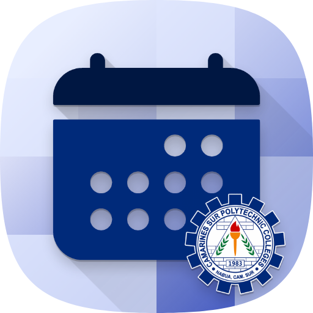
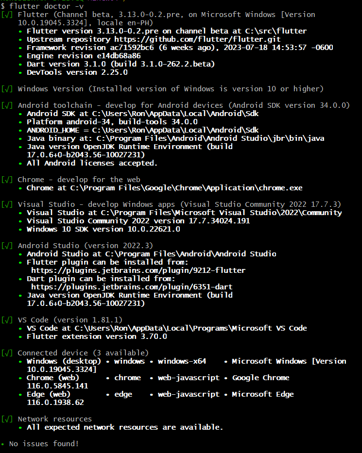

#  SparkEventify

### A Student Event Calendar App

---

## Requirements

- Flutter SDK (Comes with Dart SDK)
- Java LTS
- Android Studio
- Visual Studio Community (For Development)

---

## Installation

### Flutter with Git

1. Go to [Flutter Documentation](https://docs.flutter.dev/get-started/install) to get started.
2. Choose the appropriate OS for installing Flutter.
3. Ensure you meet the system requirements to run Git commands, or if you have [Git](https://git-scm.com/download/win) installed, proceed to the next step.
4. Download [Flutter SDK](https://docs.flutter.dev/get-started/install/windows#get-the-flutter-sdk) for Windows and follow the steps.
5. Update your path: Go to `Edit the system environment variables` and set the PATH value to `C://<path-to>/flutter/bin`. See the [documentation](https://docs.flutter.dev/get-started/install/windows#get-the-flutter-sdk) for instructions.
6. After updating the path, run `flutter doctor` in your terminal:
    ```shell
    flutter doctor
    ```

---

## Project Setup

1. Clone this repository to your project directory using [Github Desktop](https://desktop.github.com/), or open your terminal and run:
    ```shell
    git clone https://github.com/ronhedwigzape/student_event_calendar.git
    ```
2. Navigate to the project directory:
    ```shell
    cd student_event_calendar
    ```
3. Install [Visual Studio](https://visualstudio.microsoft.com/). Ensure `Desktop Development with C++` is installed.
4. Install [Google Chrome](https://www.google.com/chrome/) for completion in flutter doctor.
5. Install Android Studio. Open Android Studio and go to `More Actions` > `SDK Manager` > `SDK Tools` tab, and install `Android SDK Command-line Tools (latest)`.

### Creating an Android Emulator using Android Studio

1. **Open Android Studio**: Launch Android Studio and select `"More Options" > "Virtual Device Manager"`.
2. **Create a new Virtual Device**: Click `"Create Virtual Device"`, select a device (e.g., `Pixel XL`), and click `"Next"`.
3. **Download a System Image**: Select a version of Android, click `"Download" > "Accept" > "Next" > "Finish"`.
4. **Configure the AVD**: Set additional configuration details and a custom name for your emulator.
5. **Launch the AVD**: Select the virtual device from the dropdown menu at the top of Android Studio.

### Running Android Emulator

1. **Locate Android SDK**: Default location is `C:\Users\<your-user-name>\AppData\Local\Android\Sdk`.
2. **Set the ANDROID_HOME environment variable**: Add `C:\Users\<your-user-name>\AppData\Local\Android\Sdk\emulator` to your PATH.
3. **Set the JAVA_HOME environment variable**: Add `C:\Program Files\Java\jdk-17` to your PATH.
4. **List and run emulators**:
    ```shell
    emulator -list-avds
    emulator -avd <name-of-your-emulator>
    ```
    Example:
    ```shell
    emulator -avd Pixel_XL_API_33
    ```

6. Complete flutter doctor issues:
    ```shell
    flutter doctor --android-licenses
    ```

7. Expected output for `flutter doctor`:

    

8. If you have a device, enable `Developer Options` and `USB debugging mode`.

9. Install dependencies and start development:
    ```shell
    flutter run
    ```

10. If you encounter `Current Dart SDK version not updated` error:
    ```shell
    flutter channel beta
    flutter upgrade
    ```

11. To run on Chrome:
    ```shell
    flutter run -d chrome --web-renderer html
    ```

12. Change directory to /web and install `dotenv` package:
    ```shell
    cd /web
    npm install
    ```

---

## Production Setup

### Building and Releasing an Android App

1. **Review the App Manifest**: Check `<app dir>/android/app/src/main` and verify values.
2. **Review the Build Configuration**: Check `<app dir>/android/app/build.gradle`.
3. **Build an App Bundle**:
    ```shell
    flutter build appbundle
    ```
4. **Test the App Bundle**.
5. **Publish to Google Play**: Follow the [Google Play launch documentation](https://developer.android.com/studio/publish).

### Building and Releasing an iOS App

1. **Review the App Configuration**: Open `ios/Runner.xcworkspace` in Xcode.
2. **Select the Deployment Target**: Specify the iOS version in Xcode.
3. **Add an App Icon**: Follow the [App Icon guidelines](https://developer.apple.com/design/human-interface-guidelines/app-icons).
4. **Create a Build Archive**: Select `Product > Archive` in Xcode.
5. **Publish to the App Store**: Follow the [iOS App Store distribution guide](https://help.apple.com/xcode/mac/current/#/dev442d7f2ca).

### Building and Releasing a Web App

1. **Add Web Support**:
    ```shell
    flutter channel stable
    flutter upgrade
    flutter config --enable-web
    ```
2. **Build the App for Release**:
    ```shell
    flutter build web
    ```
3. **Serve the App**:
    ```python
    python -m http.server 8000
    ```
4. **Deploy the App**: Use [Firebase Hosting](https://firebase.google.com/docs/hosting) or any web server.

---

## Updating Dependencies

- Update dependencies:
    ```shell
    flutter pub upgrade
    ```

## Cleaning Build

- Clean the build:
    ```shell
    flutter clean
    flutter pub get
    ```

---

Enjoy using SparkEventify!